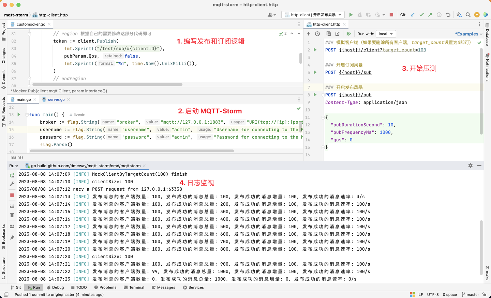

# MQTT-Storm: MQTT Stress Testing Tool

像风暴一样冲击和评估MQTT服务器的性能




## 0. 下载该项目

```shell
$ git clone https://github.com/timeway/mqtt-storm.git
$ cd mqtt-storm
```

## 1. 编写发布和订阅逻辑（Custom pub and sub logic）

update [customocker.go](internal/customocker/customocker.go)

## 2. 启动 MQTT-Storm（Build and run MQTT-Storm）

```shell
# Build
$ ./build.sh

# Run
$ ./control.sh stop
$ ./control.sh start
$ ./control.sh restart
```

## 3. 开始压测（Start test）

Run [http-client.http](http-client.http) or curl command with the same effect.

## 4. 日志监视（Log watch）

```shell
$ tail -f test.log
```
